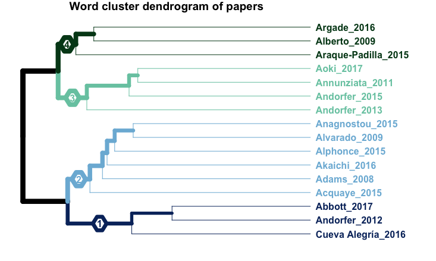
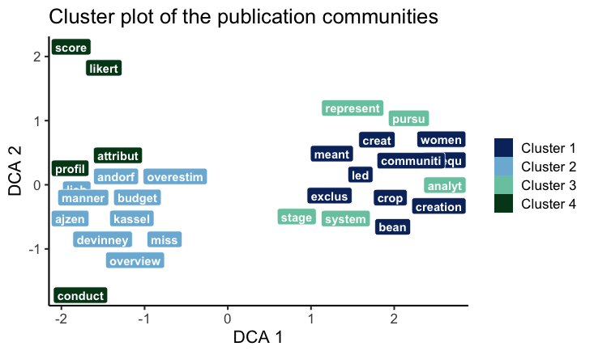
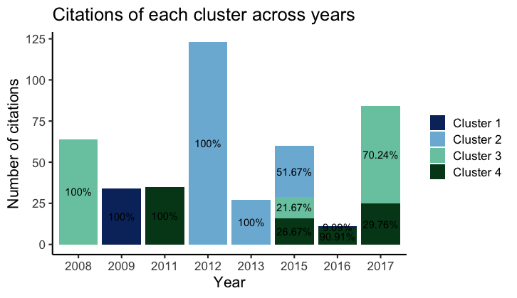
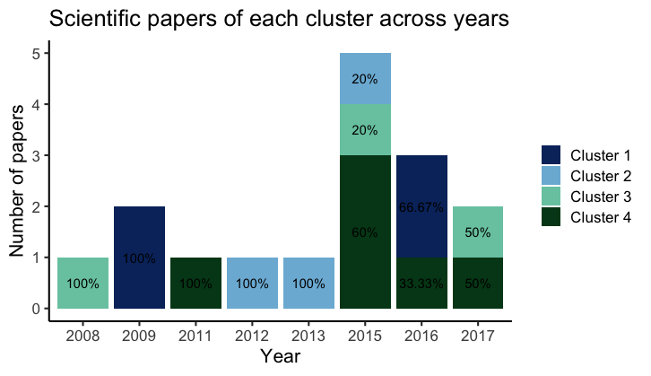

```{r setup, include = FALSE}
knitr::opts_chunk$set(
  collapse = TRUE,
  comment = "#>",
  warning = FALSE,
  fig.align = "center"
)
library(scicloud)
```
The R package _scicloud_ provides methods to perform word analysis for scientific papers stored in PDFs format. 

### REMARK: Font styling in this document:
+ a `function()` 
+ an **output** of a `function()`
+ an _argument_ of a `function()` 


## Installation
The package can be installed in the usual way: 
```
install.packages('scicloud')
```
You can install the development version from Github with: 
```
# install.packages("devtools")
devtools:install_github("LisaGotzian/scicloud")
```

## Prerequisites
+ an API key from Elsevier
+ an authorized connection to Elsevier (via your institution's network)
+ scientific papers (in PDF format) that are stored in folder named PDFs in your working directory

---
## Usage
Analysis with scicloud can be performed with a sequential execution of two functions: `createScicloudList()` and `runAnalysis()`.

### First Step: createScicloudList()
The function `createScicloudList()` prepares the data needed to perform the word analysis. It outputs a list of components: **metaMatrix**, **Tf_Idf** and **wordList**. **metaMatrix** contains information retrieved through Scopus API and from the PDFs. Please make sure you have a valid connection to Elsevier (e.g. using your institution's network) when running this function. Invalid connection will result in missing information needed for subsequent analysis. 

#### Information of metaMatrix
|COLUMNS|||||||
|:-------|:-------|:-------|:-------|:-------|:-------|:-------|
|Title|Year|Month|Day|Authors|Journal|Volume|
|Issue|Pages|CitedBy|CitationPerYear|DOI|Scopus-ID|Publisher|
|Affiliation|Affiliation-City|Affiliation-Country|FileName|Abstract|FullText|ID|     

#### Tf-Idf
the tf-idf document term matrix created after the preprocessing of metaMatrix using methods defined by the arguments: _stemWords_, _language_, _ignoreWords_ and _keepWordsFile_. When these arguments are not defined specifically, default options will be executed. 

#### wordList 
a list of all words that have been used in the analysis.

#### Example: running with default arguments
```
> myAPIKey <- "XXXXXXXXXXXXX" 
> scicloudList <- createScicloudList(myAPIKey = myAPIKey)
  |==================================================================================| 100%
  
Included 16 file(s) in metaMatrix out of 16 file(s) found in your PDFs folder.
Accessing Scopus to update the Metadata...
  |==================================================================================| 100%

Remaining quota: 9969 requests within the next 7 days.
```

#### DOI NOT FOUND ISSUE/DUPLICATED FILE ISSUE
When the DOI information is not found in the PDF, you are required to enter the information manually. You can skip the process by pressing "ENTER" but the respective papers will be excluded in the analysis. 

When there is duplicated file found in your folder. The duplicated file will be excluded in the analysis.

#### Example: when there are duplicated PDFs/DOI not found in PDFs
```
scicloudList <- createScicloudList(myAPIKey = myAPIKey)

|==================================================================================| 100%
DUPLICATED FILE ISSUE:
PDF with duplicated DOI: ./PDFs/andorfer2011.pdf  is excluded. 
PDF with duplicated DOI: ./PDFs/aoki2016.pdf  is excluded.
Check your PDFs if contain some same PDF files but with different names!

DOI NOT FOUND ISSUE: 
Please enter the DOI(s) for the respective PDF(s).
press ENTER without any input to exclude the PDF
== Enter the DOI for the following PDF(s): ==
Annunziata2014.pdf [NA]: 
Aragón-Gutiérrez2013.pdf [NA]: 
==
[OK]/Cancel 

Excluded the following file: Annunziata2014.pdf 
Excluded the following file: Aragón-Gutiérrez2013.pdf

Included 16 file(s) in metaMatrix out of 20 file(s) found in your PDFs folder.
Accessing Scopus to update the Metadata...
  |==================================================================================| 100%

Remaining quota: 9969 requests within the next 7 days.
```

#### Select preprocessing methods
You can choose the stopwords type or whether to use stemming in preprocessing the words found in the PDFs by the following arguments in `createScicloudList()` function. **Tf-Idf** output different values depend on these choices.  

_language_
  : expect a valid string object which defines the stopwords to be filtered. (e.g. "english" or "SMART") 

_stemWords_
  : expect a boolean object which defines whether stem words should be removed from the texts.

You are also provided with the options to ignore certain words or to keep certain words in the analysis. This can be defined through _ignoreWords_ and _keepWordsFile_ arguments respectively. By default these two arguments are set to be empty and they are optional.  

_ignoreWords_
  : a vector of words that to be ignored in the analysis

_keepWordsFile_
  : the file path to a CSV that specifies which words to keep in the analysis. If provided, the analysis will only keep these words and all other words will be disregarded.
  
#### Define different directory for the PDFs 
The default directory is set to be the PDFs folder in your working directory. However you may specify other valid directory that stores your PDF files with the _directory_ argument of `createScicloudList()` function. 


### Second Step: runAnalysis()
The function `runAnalysis()` is the main function that perform the word analysis. Two methods can be used: _hclust_ and _network_ which is defined via the method argument. When _hclust_ is used, an indicator species analysis will be performed. When _network_ is used, a network clustering approach will be used for the analysis. The default is set to _hclust_. You can defined _both_ to perform analysis with both methods. The output of this function hence differs based on the method argument. 

#### Output of function with method _hclust_
**IndVal**
: The results of the indicator species analysis.

**metaMatrix**
: The metaMatrix that has been processed by previous step. 

**RepresentativePapers**
: A dataframe of the most representative papers of each publication community. Papers are representative if they contain the highest number of significant words. 

**wordList**
: A list of all words that have been used in the analysis. 

#### Output of function with method _network_
**LocalMeasures**
:Local measures for both papers and words

**ReducedLocalMeasures**
: 1/3 of the words (!) with their centrality measures & clustering according to three different clustering methods, arranged by default by eigenvector centrality using 

**ReducedIncidenceMatrix**
: 1/3 of the words arranged by eigenvector centrality, to be further processed e.g. in Gephi or with other clustering functions

**GlobalMeasures**
: Global measures of the network

_scicloudList_
: the output of the function `createScicloudList()` is expected as the input of _scicloudList_ argument.

_numberOfClusters_
: numeric, it must be an integer value not more than 14. An integer sets the number of clusters manually for NA, the function automatically calculates results for 1 till 12 clusters

#### Example: 
```
> scicloudAnalysis <- runAnalysis(scicloudList = scicloudList, numberOfClusters = 4)
Calculating models
PdfsPerCluster folder is created in your working directory
All PDFs have been copied to different subfolders in the new folder 'PdfsPerCluster'
      according to the cluster they belong to.
Creating graphic
Plot a word cloud analysis?(y/n)y
Plot a stacked barplot of the no. of citations (with percentage) across years?(y/n)y
Plot a stacked barplot of the no. of papers (with percentage) across years?(y/n)y
Show most influencial papers per cluster? (y/n)n
        
###################################################################################
```









#### Other arguments of runAnalysis()
_minWordsPerCluster_
: numeric, minimum number of words to be plotted per cluster. The default value is set to 5.

_maxWordsPerCluster_
: numeric, maximum number of words to be plotted per cluster. The default value is set to 10.

_p_
: numeric, the p-value that sets the significance level of individual words for the indicator species analysis. Only significant words will be plotted in the plots. The default value is set to 0.05.
 
_exactPosition_
: logical, used for the cluster plot of significant words to avoid overlapping labels for the sake of visual simplicity over perfect precision. When set to TRUE, the words position will be marked by a dot and the label will be connected with a line to it. The default value is set to FALSE.

_dendrogram_
: logical, whether or not to plot a dendrogram of the calculated clusters. The default value is set to TRUE
                        
_dendroLabels_
= label setting of the dendrogram, allows to be "truncated" or "break". This either truncates the labels of the dendrogram leaves or puts a line break. Line breaks are not recommended for a large number of PDFs. The default value is set to "truncated".

_generateWordlist_
: logical, if set to TRUE, it generates a wordlist called "scicloudWordlist.csv" in your working directory. The list contains all significant words from the indicator species analysis that are representative for the respective paper clusters. To work with the new wordlist, read it in using _keepWordsFile_ as an argument to `createScicloudList()` function. The default value is set to FALS.E

## Other functions in the package
inspectScicloud()
: When the method _hclust_ is used in `runAnalysis()`, a summary of the analysis can be generated and printed on the console using `inspectScicloud()` 

deleteRDS()
: The output of `createScicloudList()` and `runAnalysis()` can be saved as a RDS object in your working directory using the _saveToWd_ argument. You can run `deleteRDS()` to delete these RDS files with three different ways: 
1. Delete All RDS files in your working directory 
2. Keep the latest RDS files of each data type 
3. Keep only the selected data type of RDS files, delete all others

#### Example: inspectScicloud()
```
scicloudSpecs <- inspectScicloud(scicloudAnalysis)

Summary of the scicloud analysis

Total papers: 16, processed papers: 16, excluded papers: 0,
Total words: 5265, words that are in 5% of all papers that have been used for the analysis: 5265

Papers per Cluster:
Cluster 1 with 4 papers
Cluster 2 with 3 papers
Cluster 3 with 3 papers
Cluster 4 with 6 papers

The following additional specs are available:
- Paper-Cluster-Table: Each paper belongs to one cluster. Use View(scicloudSpecs$paperCluster) to see which paper belongs to which cluster.
- Words-Cluster-Table: Words do not belong to one single cluster. An indicator species analysis shows how representative each word is for each cluster. Use View(scicloudSpecs$IndVal) to view the results of the indicator species analysis.
- excluded Papers: use View(scicloudSpecs$excludedPapers) to see which papers have been excluded, possibly because of a PDF error.
- most representative Papers: use View(scicloudSpecs$representativePapers) to see which papers are the most representative ones, weighted with the indicator species values of the words in the paper.
- Matrix with metadata of the papers: use View(scicloudSpecs$metaMatrix) to view the original metaMatrix (without full texts, so it's safe to open).$paperCluster
....
```

#### Example: deleteRDS()
```
## To delete either scicloudList RDS or runAnalysis RDS
> deleteRDS()

Which RDS files to be deleted in current directory? 

1: Delete All RDS files
2: Keep the latest of each data, delete all others
3: Keep only a specific data, delete all other type
4: Quit

Selection: 3
Which RDS data to keep? 

1: scicloudList
2: runAnalysis
3: Quit

Selection: 1
Deleted runAnalysis2020_10_18_08_59_58.RDS
 Deleted runAnalysis2020_11_18_08_59_58.RDS
```